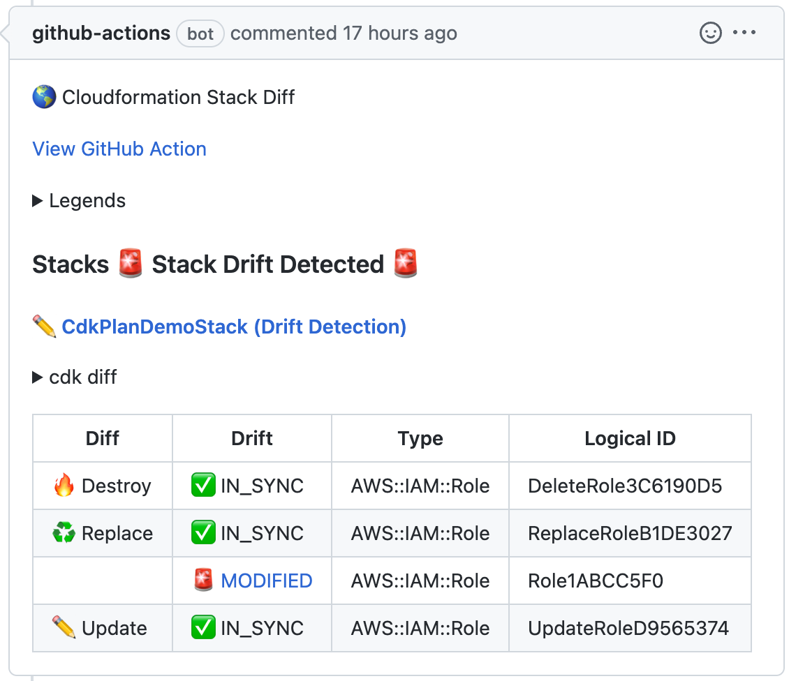

# CDK diff commenter Action

This action works on pull request.
Run cdk synth and calculate difference and drifts of stacks,
and comment its result to pr.



## Usage

See [action.yml](action.yml)

### Basic

```yaml
on:
  pull_request:
jobs:
  build:
    runs-on: ubuntu-latest
    steps:
      - uses: actions/checkout@v3
      - name: Setup Node.js
        uses: actions/setup-node@v3
        with:
          node-version: 16.x
      - run: npm ci

      - uses: tsuba3/cdk_plan_action@main
        env:
          AWS_ACCESS_KEY_ID: ${{ secrets.AWS_ACCESS_KEY_ID }}
          AWS_SECRET_ACCESS_KEY: ${{ secrets.AWS_SECRET_ACCESS_KEY }}
          GH_TOKEN: ${{ secrets.GITHUB_TOKEN }}
        with:
          aws-region: 'ap-northeast-1'
```
